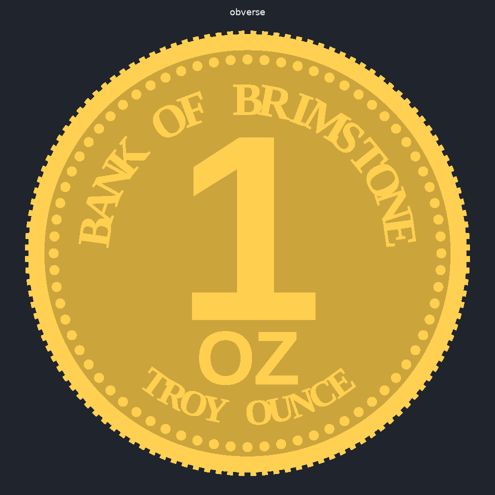
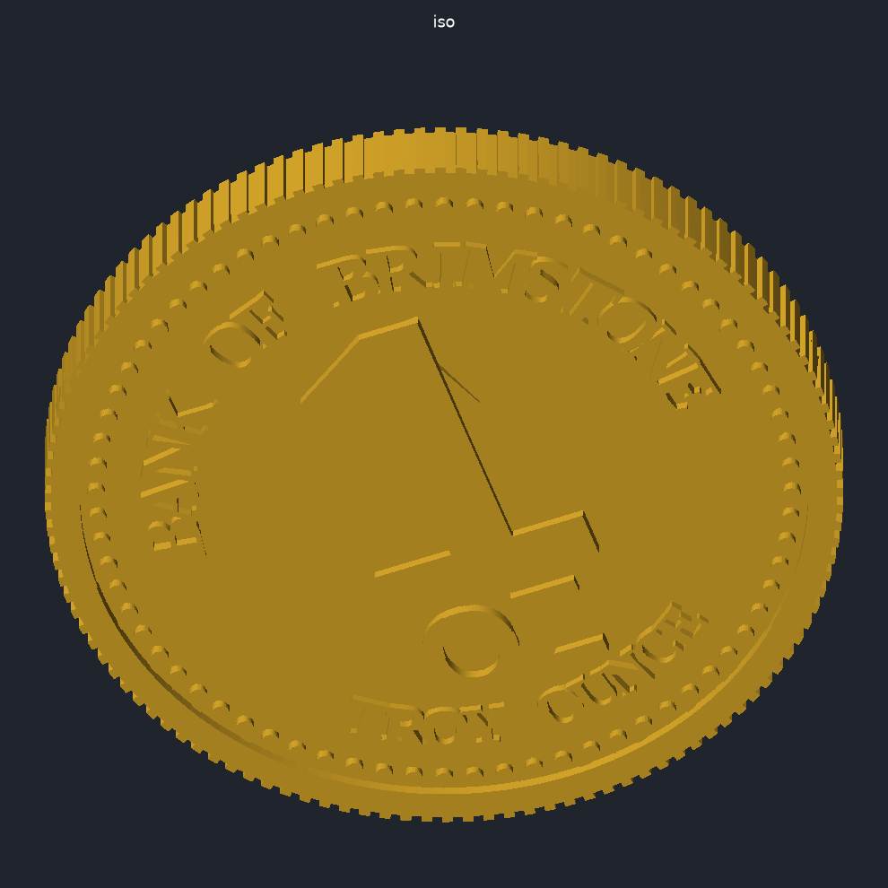

# Bank of Brimstone – Gold Bullion Coin

Parametric OpenSCAD model of a bullion coin. The weight in ounces is the
dominant element of the obverse; everything else (legends, emblem, rim,
reeded edge, beads) is parametrized too.

| Obverse | Reverse | Iso |
|---|---|---|
|  |  |  |

## Files

* `brimstone_coin.scad` – the model (open in OpenSCAD, use the Customizer panel)
* `brimstone_coin_1oz.stl` – rendered default: 1 oz, 32.7 × 2.9 mm, 120 reeds
* `preview_*.png` – renders of the STL above

## Main parameters

| Parameter | Default | Notes |
|---|---|---|
| `weight_value` | `1` | Ounces; printed large on the obverse (`0.5`, `2`, `5`, …). Numeral auto-shrinks for longer values |
| `weight_text_override` | `""` | Force the numeral text (e.g. `"1/2"`, `"¼"`) |
| `weight_unit` / `weight_caption` | `"OZ"` / `"TROY OUNCE"` | Under the numeral / lower arc |
| `bank_name` | `"BANK OF BRIMSTONE"` | Upper arc of the obverse |
| `motto_text`, `fineness_text`, `year_text` | `"IN FIRE WE TRUST"`, `".999 FINE GOLD"`, `"2026"` | Reverse legends |
| `diameter`, `thickness` | `32.7`, `2.9` | mm – same as a 1 oz American Eagle |
| `rim_width`, `rim_height`, `relief` | `1.4`, `0.4`, `0.4` | Raised rim protects the relief when `relief <= rim_height` |
| `relief_style` | `raised` | `raised` or `engraved` |
| `alignment` | `medal` | `medal` (flip about vertical axis) or `coin` (flip about horizontal axis) |
| `beads`, `bead_d` | `72`, `0.7` | Beaded inner border (0 = none) |
| `reeds`, `reed_depth`, `reed_width` | `120`, `0.25`, `0.45` | Reeded edge (0 = smooth) |
| `emblem_size` | `13` | Height of the flame on the reverse |
| `font_bold`, `font_serif` | Liberation Sans/Serif Bold | Fonts bundled with OpenSCAD |
| `part` | `coin` | `coin`, `obverse_half` or `reverse_half` (split at mid-plane, flat face down, for face-up printing and gluing) |

## Rendering from the command line

```sh
openscad -o brimstone_coin_1oz.stl brimstone_coin.scad
openscad -o brimstone_coin_5oz.stl -D 'weight_value=5' brimstone_coin.scad
openscad -o brimstone_coin_half_oz.stl -D 'weight_text_override="1/2"' brimstone_coin.scad
openscad -o obverse.stl -D 'part="obverse_half"' brimstone_coin.scad
```

The full coin with reeds and `$fn = 180` takes a couple of minutes to render
with CGAL (OpenSCAD 2021.01). Lower `$fn` or set `reeds = 0` while iterating.

## Printing (resin)

* 0.4 mm relief and 0.7 mm beads are fine at 50 µm layers.
* For the best surface on both faces, print `obverse_half` and `reverse_half`
  flat on the plate and glue them; otherwise print the whole coin tilted with
  supports on the edge.
